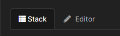

# Tecnologias utilizadas

### 1º - Github Actions -> Automação

### 2º - Docker         -> Virtualizador de nível de SO

### 3º - Portainer      -> Gerencinamento de containers

# 1º Github Actions

GitHub Actions é uma ferramenta de automação de fluxo de trabalho integrada ao GitHub, que permite aos desenvolvedores automatizar processos como compilação, teste e implantação de software diretamente nos repositórios GitHub.

## Como está sendo utilizando?

O INBCM está dividido em 3 repositórios (**inbcm-backend**, **inbcm-admin-frontend** e **inbcm-public-frontend**) e em cada um deles há uma actios que fica em "/.github/workflows/Nome_action.yml" no qual contém o conteúdo abaixo:

    name: Publish Docker image     | Nome da action

    -------------------------------| 
    on:                            | 
    workflow_dispatch:             | Esse bloco permite que o código seja executado de duas 
    pull_request:                  | maneiras, (workflow_dispatch) permite o manual na aba
        branches:                  | actions do github e (pull_request) permite o automático
        - main                     | no qual definimos as branches que fara a ativação dessa
        - development              | actions quando um pull_request fechado.
        types: [closed]            |   
    -------------------------------|

    -------------------------------------------------|
    jobs:                                            | Aqui é onde começa os trabalhos fazemos
    push_to_registry:                                | uma verificação para saber so o pr foi 
        name: Push Docker image to Registry          | fechado com um merge, caso sim, vai ini
        if: github.event.pull_request.merged == true | ciar essa action, além de escolher qual
        runs-on: ubuntu-latest                       | SO vai rodar essa action (ubuntu).
    -------------------------------------------------|

    ----------------------------------|
        steps:                        | Esse bloco faz um git clone do projeto para dentro da
        - name: Check out the repo    | VM que escolhemos, no caso ubuntu, existe windows e
            uses: actions/checkout@v3 | mac ,mas ficamos com a atual.
    ----------------------------------|

    ------------------------------------------------------------------------|
        - name: Set Docker repository name for main branch                  |
            if: github.ref == 'refs/heads/main'                             |
            run: echo "DOCKER_REPOSITORY=inbcm-backend-main" >> $GITHUB_ENV |Aqui verifica qual
                                                                            |branch alvo do marge
                                                                            |pois a imagem será
        - name: Set Docker repository name for development branch           |enviada para um 
            if: github.ref == 'refs/heads/development'                      |dockerhub específico
            run: echo "DOCKER_REPOSITORY=inbcm-backend" >> $GITHUB_ENV      |
    ------------------------------------------------------------------------|

    -------------------------------------------------|
        - name: Log in to Docker Registry            |
            uses: docker/login-action@v3             | Aqui ocorre o login, no qual foi
            with:                                    | definido nas secrets as variáveis
            username: ${{ secrets.DOCKER_USERNAME }} | de login e senha para o dockerhub
            password: ${{ secrets.DOCKER_PASSWORD }} |
    -------------------------------------------------|

    ------------------------------------------|
        - name: Build and push Docker image   |Por fim o deploy, aqui e gerado uma imagem 
            uses: docker/build-push-action@v6 |a partir do Dockerfile que está no repositório
            with:                             |e feito o push para o dockerhub.
            context: .                        |
            file: ./Dockerfile                |--------------------------------------|
            push: true                                                               |
            tags: ${{ secrets.DOCKER_USERNAME }}/${{ env.DOCKER_REPOSITORY }}:latest |
    ---------------------------------------------------------------------------------|

# 2º Docker

Docker é uma plataforma de software que permite criar, testar e implantar aplicações rapidamente em ambientes isolados, chamados de containers.

## Como está sendo utilizando?

Em nossos repositórios há 3 Dockerfiles dois identicos para o front-end e um apenas para o back-end

- Dockerfile front-end

        ----------------------------|
        FROM node:20-slim AS base   | Nesse bloco escolhemos nossa imagem e um apelido para que
        ENV PNPM_HOME="/pnpm"       | seja reutilizada mais a frente, criamos 2 ENV um para o 
        ENV PATH="$PNPM_HOME:$PATH" | diretório do pnpm e o outro e com caminho que faz a execução
        RUN corepack enable         | do pnpm, além de rodar um comando para ativar o corepack.
        ----------------------------|

        --------------------------------------------------|
        FROM base AS build                                |Aqui reutilizamos nossa imagem e colocamos outro 
                                                          |apelido.  
                                                          |
        COPY . /usr/src/app                               |Copiamos o que tem no diretório "/usr/src/app"
                                                          |para dentro do container.
                                                          |
        WORKDIR /usr/src/app                              |Informamos o diretório de manipulação de arquivos.
                                                          |------------------------------|
                                                                                         |
        RUN --mount=type=cache,id=pnpm,target=/pnpm/store pnpm install --frozen-lockfile |Criamos um cache temporário
                                                                                         |do conteúdo necessário para
                                                                                         |aplicação que vai ser usado 
                                                                                         |jájá.
                                                                                         |
        RUN pnpm build                                                                   |Comando para 
        ---------------------------------------------------------------------------------|compilar o código.

        ---------------------------------------|
        FROM devforth/spa-to-http              | Aqui escolhemos uma imagem adquada para nosso ambiente
        COPY --from=build /usr/src/app/dist .  | Copiamos o conteúdo do cache temporário que foi criado 
        ---------------------------------------| na imagem anterior apelidada de "build" para nosso container.

- Dockerfile back-end

        -----------------------------|
        FROM node:20-slim AS base    |
        ENV PNPM_HOME="/pnpm"        |Esse bloco segue um padrão parecido 
        ENV PATH="$PNPM_HOME:$PATH"  |do front-end a diferença e que ele
        RUN corepack enable          |já indica o diretório de trabalho e
        COPY . /app                  |copia o conteúdo local para lá.
        WORKDIR /app                 |
        -----------------------------|

        ----------------------------------------------------------------------------------------|
        FROM base AS prod-deps                                                                  |
        RUN --mount=type=cache,id=pnpm,target=/pnpm/store pnpm install --prod --frozen-lockfile |Aqui também segue o 
                                                                                                |padrão do front-end
        FROM base AS build                                                                      |criamos uma cache com 
        RUN --mount=type=cache,id=pnpm,target=/pnpm/store pnpm install--frozen-lockfile         |o conteúdo necessário
                                                                                                |para rodar a aplicação
        RUN pnpm run build                                                                      |e apilidamos para ser 
                                                                                                |utilizados mais a 
        ----------------------------------------------------------------------------------------|frente.

        -----------------------------------------------------------|
        FROM base                                                  |Nesse último bloco copiamos
        COPY --from=prod-deps /app/node_modules /app/node_modules  |todos os conteúdo que foram 
        COPY --from=prod-deps /app/package.json /app/package.json  |gerandos em cache na etapa 
        COPY --from=build /app/dist /app/dist                      |anterior para a imagem final.
        EXPOSE 3000                                                |Libera a porta necessária da 
        CMD [ "pnpm", "start" ]                                    |aplicação e o comando para 
        -----------------------------------------------------------|iniciar.

### Exemplo do passo a passo de como gera uma imagem usando docker (Método manual):

OBS: Supondo que você já tenha o docker em sua máquina, caso não, segue o site oficial para instalação:

https://docs.docker.com/engine/install/  (Aqui vai encontra a instalção tanto da GUI como CLI do docker)

1º Precisamos de um arquivo Dockerfile, vamos usar algo simples:

1.1 Aqui escolhemos um SO que vai ser utilzado no container.

    FROM alpine:latest          

1.2 O comando abaixo informa ao container o que ele deve fazer,no caso, escrever "hello" na tela.

    CMD ["echo","Hello"]

1.3 Logo seu Dockerfile deve ter esse conteúdo.

    FROM alpine:latest
    CMD ["echo","Hello"]     

2º Agora que temos nosso Dockerfile vamos buildar/gerar uma imagem.

3º Após criarmos a imagem podemos verificar se realmete foi criada usando:

- docker images

3.1 Vai aparecer assim.

4º Para rodar essa imagem usamos:

- docker run exemplo/hello

vai executar o que foi escrito no Dockerfile.

# 3º Portainer

Portainer é uma ferramenta de gerenciamento de containers que oferece uma interface gráfica de usuário (GUI), Ele simplifica o gerenciamento de containers, imagens, redes e volumes, permitindo que usuários interajam com esses recursos de maneira visual, em vez de usar apenas a linha de comando.

## Observações

- Atualmente o projetos está hospedado no servidor da UNB (Universidade de Brasília)
- O ambiente está dentro de um cluster
- O ambiente está fazendo o redirecionamento para seus respectivos destinos usando o **Traefik**, no qual há uma rede interna
  que faz essa comunicação.
 
## Como está sendo utilizando?

Acessar portainer: https://portainer.tainacan.org

No portainer atualmente temos 4 stacks:

|        Stacks             | Branchs|                                 
|---------------------------|--------|
|inbcm                      |  main  |     
|homologacao_curadoria_ifrn |  main  |  
|inbcm-dev                  |  dev   |    
|dev_curadoria_ifrn         |  dev   |  

Ao clicar em uma delas vai abrir o gerenciador de stacks e lá temos essas duas opções

- Stack
    - Informa os container que estão rodando nessa stack
- Editor
    - Fazer edições em nossa stack

Cada stack tem um docker-compose que fica na aba "Editar" no qual é utilizado para subir o ambiente:

_**Docker-compose (inbcm-dev)**_

    version: "3.5"  | Versão do compose

    ------------------------------|
    networks:                     | 
    ifrn_dev_internal_network:    |Aqui informamos ao compose a rede 
    traefik_proxy:                |compartilhada entre os containers
        external: true            |  
    ------------------------------|

    ------------------------------------------|
    volumes:                                  |Esse bloco informa os volumes, ou seja    
    mongo-data:                               |onde será armazenado (Declarações, recibos
        driver: local                         |entre outros...)
        driver_opts:                          |
        type: nfs                             |Os volumes são armazenadas em um host diferente no 
        o: nfsvers=4,addr=10.10.10.100,rw     |qual o ip: 10.10.10.100 que permite ler e escrever
        device: ":/NFS_VOL/HDD/ifrn/mongodev" |
    uploads-data:                             | 
    ------------------------------------------| 

    
    services:   |Informa que abaixo serão configurados os serviços

    --------------------------------------------|
    mongo:                                      |        
        image: mongo                            |Aqui informamos a imagem
        volumes:                                |os volumes,variáveis 
        - mongo-data:/data/db                   |ambiente e a rede do 
        environment:                            |serviço do mongo
        MONGO_INITDB_ROOT_USERNAME: ${DB_USER}  |
        MONGO_INITDB_ROOT_PASSWORD: ${DB_PASS}  |**image:** Imagem utilizada
        MONGO_INITDB_DATABASE: ${DB_NAME}       |**volumes:** Armazenamento
        networks:                               |**environment:** Variáveis
        - ifrn_dev_internal_network             |de ambiente
    --------------------------------------------|**networks:** Rede

    ---------------------------------------------------------------------|
    mongo-express:                                                       |     
        image: mongo-express                                             |A grande diferença nesse bloco comparado com o 
        environment:                                                     |anterior e a parte de (deploy:) 
        ME_CONFIG_BASICAUTH_USERNAME: ${DB_USER}                         | 
        ME_CONFIG_BASICAUTH_PASSWORD: ${DB_PASS}                         | 
        ME_CONFIG_MONGODB_PORT: 27017                                    |Nele definimos as configurações que o 
        ME_CONFIG_MONGODB_ADMINUSERNAME: ${DB_USER}                      |traefik vai precisar para pode reconhecer  
        ME_CONFIG_MONGODB_ADMINPASSWORD: ${DB_PASS}                      |o container e poder fazer seu roteamento   
        ME_CONFIG_MONGODB_SERVER: mongo                                  |corretamente quando solicitado, cada linha  
        depends_on:                                                      |a abaixo de _labels:_ tem um significado  
        - mongo                                                          |específico, outro detalher e o(depends_on)
        networks:                                                        |informa ao container que depende de outro
        - traefik_proxy                                                  |no caso o mongo que e o banco de dado do
        - ifrn_dev_internal_network                                      |bloco acima.
        deploy:                                                          | 
        labels:                                                          |
            - traefik.enable=true                                        |Permiti o traefik identificar os containers
                                                                         |-------------------------|
            - traefik.docker.network=traefik_proxy                                                 |Especifica a rede do
                                                                                                   |do traefik.
                                                                                                   | 
            - traefik.constraint-label=traefik-public                                              |Garante solicitação 
                                                                                                   |apenas para esse 
                                                                                                   |container. 
                                                                                                   |
            - traefik.http.routers.dev-inbcm-mongoexpress-http.rule=Host(`mongoexpress.${DOMAIN}`) |Apropria a rota HTTP 
                                                                                                   |para o domínio entre
                                                                                                   |()
                                                                                                   |
            - traefik.http.routers.dev-inbcm-mongoexpress-http.entrypoints=http                    |Especifica a rota 
                                                                                                   |HTTP
                                                                                                   |
            - traefik.http.routers.dev-inbcm-mongoexpress-http.middlewares=https-redirect          |Redireciona o 
                                                                                                   |tráfego para HTTPS
                                                                                                   |
            - traefik.http.routers.dev-inbcm-mongoexpress-https.rule=Host(`mongoexpress.${DOMAIN}`)|Apropria HTTPS 
                                                                                                   |para o domínio 
                                                                                                   |entre ()        
                                                                                                   |
            - traefik.http.routers.dev-inbcm-mongoexpress-https.entrypoints=https                  |Especifica a rota 
                                                                                                   |HTTPS 
                                                                                                   | 
            - traefik.http.routers.dev-inbcm-mongoexpress-https.tls=true                           |Habilita o TLS
                                                                                                   | 
            - traefik.http.routers.dev-inbcm-mongoexpress-https.tls.certresolver=le                |Define o Let's 
                                                                                                   |Encrypt para 
                                                                                                   |geri o certificado
                                                                                                   |
            - traefik.http.services.dev-inbcm-mongoexpress.loadbalancer.server.port=8081           |Especifica a porta 
                                                                                                   |apenas para o 
                                                                                                   |container deste 
    -----------------------------------------------------------------------------------------------|serviço.

    ---------------------------------------------------------------------------------------------------------------------|
    backend:                                                                                                             |   
        image: Nome_repositório_dockerhub/inbcm-backend                                                                  |
        networks:                                                                                                        |
        - traefik_proxy                                                                                                  |
        - ifrn_dev_internal_network                                                                                      |
        environment:                                                                                                     |
        DB_USER: ${DB_USER}                                                 |Explicação|                                 |
        DB_PASS: ${DB_PASS}                   |--------------------------------------------------------------------------|   
        DB_URL: ${DB_URL}                     |A diferença entre esse bloco e o de cima são as duas maiores linhas       |   
        JWT_SECRET: ${JWT_SECRET}             |elas apenas informão um prefixo para o domínio, por exemplo; digamos que  |  
        PUBLIC_SITE_URL: ${PUBLIC_SITE_URL}   |o domínion é  (exmplo.com.br) nesse caso ficaria api.exemplo.com.br.       | 
        ADMIN_SITE_URL: ${ADMIN_SITE_URL}     |                                                                          |   
        depends_on:                           |--------------------------------------------------------------------------|     
        - mongo                                                                                                          |     
        deploy:                                                                                                          |     
        labels:                                                                                                          |   
            - traefik.enable=true                                                                                        |
            - traefik.docker.network=traefik_proxy                                                                       |
            - traefik.constraint-label=traefik-public                                                                    |  
            - traefik.http.routers.dev-inbcm-backend-http.rule=Host(`${DOMAIN}`) && PathPrefix(`/api`) ||                | 
              Host(`admin.${DOMAIN}`) && PathPrefix(`/api`)                                                              | 
                                                                                                                         | 
            - traefik.http.routers.dev-inbcm-backend-http.entrypoints=http                                               | 
            - traefik.http.routers.dev-inbcm-backend-http.middlewares=https-redirect                                     |
            - traefik.http.routers.dev-inbcm-backend-https.rule=Host(`${DOMAIN}`) && PathPrefix(`/api`) ||               | 
              Host(`admin.${DOMAIN}`) && PathPrefix(`/api`)                                                              | 
                                                                                                                         | 
            - traefik.http.routers.dev-inbcm-backend-https.entrypoints=https                                             | 
            - traefik.http.routers.dev-inbcm-backend-https.tls=true                                                      |
            - traefik.http.routers.dev-inbcm-backend-https.tls.certresolver=le                                           |
            - traefik.http.services.dev-inbcm-backend.loadbalancer.server.port=3000                                      | 
        volumes:                                                                                                         | 
        - uploads-data:/uploads                                                                                          | 
    ---------------------------------------------------------------------------------------------------------------------|

    --------------------------------------------------------------------------------|
    public:                                                                         |
        image: Nome_repositório_dockerhub/inbcm-public                              |
        networks:                                                                   |
        - traefik_proxy                                                             |
        - ifrn_dev_internal_network                                                 |
        restart: always                                                             |
        depends_on:                                                                 |       
        - backend                                                                   |
        - mongo                                                                     |
        deploy:                                                                     |Aqui segue o mesmo 
        labels:                                                                     |padrão de configuração de:
            - traefik.enable=true                                                   |
            - traefik.docker.network=traefik_proxy                                  |network,depends_on e deploy.
            - traefik.constraint-label=traefik-public                               |
            - traefik.http.routers.dev-inbcm-upload-http.rule=Host(`${DOMAIN}`)     |    
            - traefik.http.routers.dev-inbcm-upload-http.entrypoints=http           |
            - traefik.http.routers.dev-inbcm-upload-http.middlewares=https-redirect |
            - traefik.http.routers.dev-inbcm-upload-https.rule=Host(`${DOMAIN}`)    |
            - traefik.http.routers.dev-inbcm-upload-https.entrypoints=https         |
            - traefik.http.routers.dev-inbcm-upload-https.tls=true                  |
            - traefik.http.routers.dev-inbcm-upload-https.tls.certresolver=le       |
            - traefik.http.services.dev-inbcm-upload.loadbalancer.server.port=8080  |
    --------------------------------------------------------------------------------|

    ----------------------------------------------------------------------------------|
    admin:                                                                            |
        image: Nome_repositório_dockerhub/inbcm-admin:latest                          | 
        restart: always                                                               |      
        depends_on:                                                                   | 
        - backend                                                                     |     
        - mongo                                                                       | 
        networks:                                                                     |     
        - traefik_proxy                                                               |
        - ifrn_dev_internal_network                                                   |
        deploy:                                                                       |Aqui segue o mesmo 
        labels:                                                                       |padrão de configuração de:  
            - traefik.enable=true                                                     |
            - traefik.docker.network=traefik_proxy                                    |network,depends_on e deploy.     
            - traefik.constraint-label=traefik-public                                 | 
            - traefik.http.routers.dev-inbcm-admin-http.rule=Host(`admin.${DOMAIN}`)  | 
            - traefik.http.routers.dev-inbcm-admin-http.entrypoints=http              |
            - traefik.http.routers.dev-inbcm-admin-http.middlewares=https-redirect    |
            - traefik.http.routers.dev-inbcm-admin-https.rule=Host(`admin.${DOMAIN}`) | 
            - traefik.http.routers.dev-inbcm-admin-https.entrypoints=https            | 
            - traefik.http.routers.dev-inbcm-admin-https.tls=true                     | 
            - traefik.http.routers.dev-inbcm-admin-https.tls.certresolver=le          | 
            - traefik.http.services.dev-inbcm-admin.loadbalancer.server.port=8080     | 
    ----------------------------------------------------------------------------------|

_**Docker-compose (dev_curadoria_ifrn )**_

        
    version: '3.5'   |  Versão do compose 

    -----------------------|
    networks:              | 
    traefik_proxy:         |Informa a rede dessa 
        external: true     |compose.
    -----------------------|

    ---------------------------------------------------------|
    volumes:                                                 |       
        homologacaocuradoria_www:                            | 
            driver: local                                    |   
            driver_opts:                                     |Informa o local de 
            type: nfs                                        |armazenamento desse
            o: nfsvers=4,addr=10.10.10.100,rw                |compose.
            device: ":/NFS_VOL/HDD/homologacao_curadoria"    |
    ---------------------------------------------------------|   
        
    --------------------------------------------------------------|    
    services:                                                     |
    tainacan:                                                     |
        image: tainacan/php:7.4-fpm-apache                        |Configurações básicas de imagem    
        networks:                                                 |rede e variável de ambiente.
        - traefik_proxy                                           |
        environment:                                              |
        SKIP_WP_INSTALL: "false"                                  |          
    --------------------------------------------------------------|
        #site config:                                             |  
        SITE_LANGUAGE: pt_BR                                      |  
        SITE_URL: ***                                             |  
        SITE_TITLE: ***                                           |Variáveis ambientes de configuração  
        SITE_ADMIN_USER: ***                                      |do site.
        SITE_ADMIN_EMAIL: ***                                     |  
        SITE_ADMIN_PASSWORD: ***                                  |  
    --------------------------------------------------------------|  
        #wordpress config:                                        | 
        DBNAME: ***                                               |Variáveis ambientes de configuração
        DB_USER: ***                                              |do wordpress.
        DB_PSWD: ***                                              |      
        DB_HOST: ***                                              |  
    --------------------------------------------------------------|
        #APACHE,PHP,FPM config                                    |  
        PHP_POST_MAX_SIZE: ***                                    |  
        PHP_UPLOAD_MAX_FILE_SIZE: ***                             |
        PHP_MAX_EXECUTION_TIME: ***                               |  
        PHP_MEMORY_LIMIT: ***                                     |
        PHP_POOL_NAME: ***                                        |  
        PHP_DATE_TIMEZONE: ***                                    |  
        PHP_DISPLAY_ERRORS: ***                                   |      
        PHP_ERROR_REPORTING: ***                                  | 
        PHP_PM_CONTROL: ***                                       |  
        PHP_PM_MAX_CHILDREN: ***                                  |  
        PHP_PM_START_SERVERS: ***                                 |     
        PHP_PM_MIN_SPARE_SERVERS: ***                             | 
        PHP_PM_MAX_SPARE_SERVERS: ***                             |Variáveis ambientes de configuração
        MSMTP_RELAY_SERVER_HOSTNAME: ***                          |do APACHE,PHP e FPM.
        MSMTP_RELAY_SERVER_PORT: ***                              |
        APACHE_DOCUMENT_ROOT: ***                                 |  
        APACHE_START_SERVERS: ***                                 |      
        APACHE_MIN_SPARE_THREADS: ***                             |  
        APACHE_MAX_SPARE_THREADS: ***                             |  
        APACHE_THREAD_LIMIT: ***                                  |  
        APACHE_THREADS_PER_CHILD: ***                             |
        APACHE_MAX_REQUEST_WORKERS: ***                           |  
        APACHE_MAX_CONNECTIONS_PER_CHILD: ***                     |  
        APACHE_RUN_USER: ***                                      |  
        APACHE_RUN_GROUP: ***                                     |  
    --------------------------------------------------------------| 

    --------------------------------------------------------|
        deploy:                                             |Essa etapa não diferente das
        labels:                                             |anteriores informa ao traefik 
            - traefik.enable=true                           |as rotas o protocolo, domínio,
            - traefik.docker.network=traefik_proxy          |certificado e rotas.          
            - traefik.constraint-label=traefik-public       |---------------------------------------------------|
            - traefik.http.routers.wphomologacaocuradoria-http.rule=Host(`homologacao.curadoria.tainacan.org`)  |
            - traefik.http.routers.wphomologacaocuradoria-http.entrypoints=http                                 |
            - traefik.http.routers.wphomologacaocuradoria-http.middlewares=https-redirect                       |
            - traefik.http.routers.wphomologacaocuradoria-https.rule=Host(`homologacao.curadoria.tainacan.org`) |
            - traefik.http.routers.wphomologacaocuradoria-https.entrypoints=https                               |
            - traefik.http.routers.wphomologacaocuradoria-https.tls=true                                        |
            - traefik.http.routers.wphomologacaocuradoria-https.tls.certresolver=le                             |
            - traefik.http.services.wphomologacaocuradoria.loadbalancer.server.port=80                          |
        volumes:                                                                                                |
        - homologacaocuradoria_www:/var/www/html/                                                               |
    ------------------------------------------------------------------------------------------------------------|        

Temos os seguinte desenhos lógicos para melhor visualização da infra:

